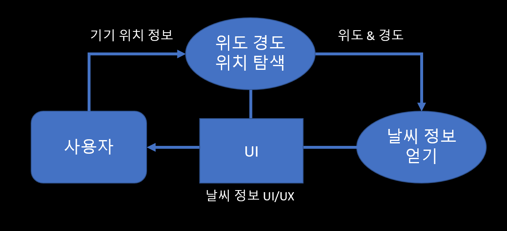
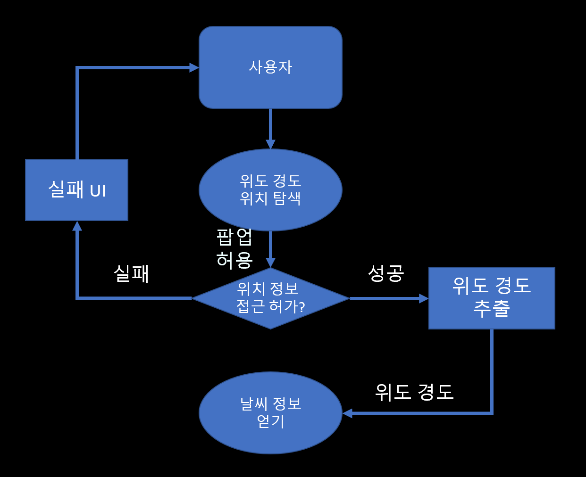
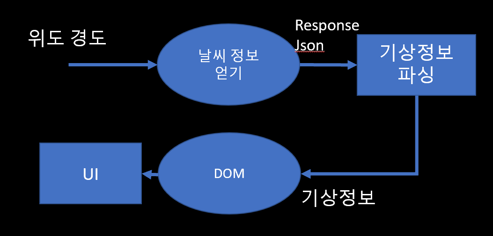

# Weather Project 기획 문서

## 목차
[1. 개요](#1-개요)
[2. 기능적목표](#2-기능적-목표)
[3. 요구,제약사항](#3-제약-사항)

---

### 1. 개요
* 접속한 기기 (모바일, PC) 플랫폼들의 위치에 따라 현재 날씨의 정보를 시각적이고 심미적으로 제공하는 것이 주목표입니다.

### 2. 기능적 목표

#### 2-1 자료 흐름도
* **1. 최상위** 
  * 

* **2.위도 경도 위치탐색**
  * 
	* input : 팝업 허용
	* output : latitude longitude

* **3.날씨 정보 얻기**
  * 
  * input : latitude longitude
  * output : weather Json

#### 2-2 기능 
1. 아이콘 : 날씨와 시간 따라 각기 다른 아이콘
	* 디자인 툴 : clip Studio ,Figma, Zeplin
2. 배경 : 날씨와 시간 따라 각기 다른 아이콘
	* 저녁에 가까워질수록 점점 어두워지기
	* 구름이 많아질수록 배경이 점점 채도 감소(탁해짐)
3. 수치적 정보 : 온도, 시간
	* 아이콘 밑에 온도 표시
	* 좌측 상단에 현재 시각 출력
4. 위치 정보 : (도/시/군/구/동/읍/면/리)
	* 위치 정보는 영어 표기

### 3. 제약 사항
- Client
  - 1. 웹 브라우저 사용 가능환경
  - 2. 모바일 & PC 해상도 사용환경