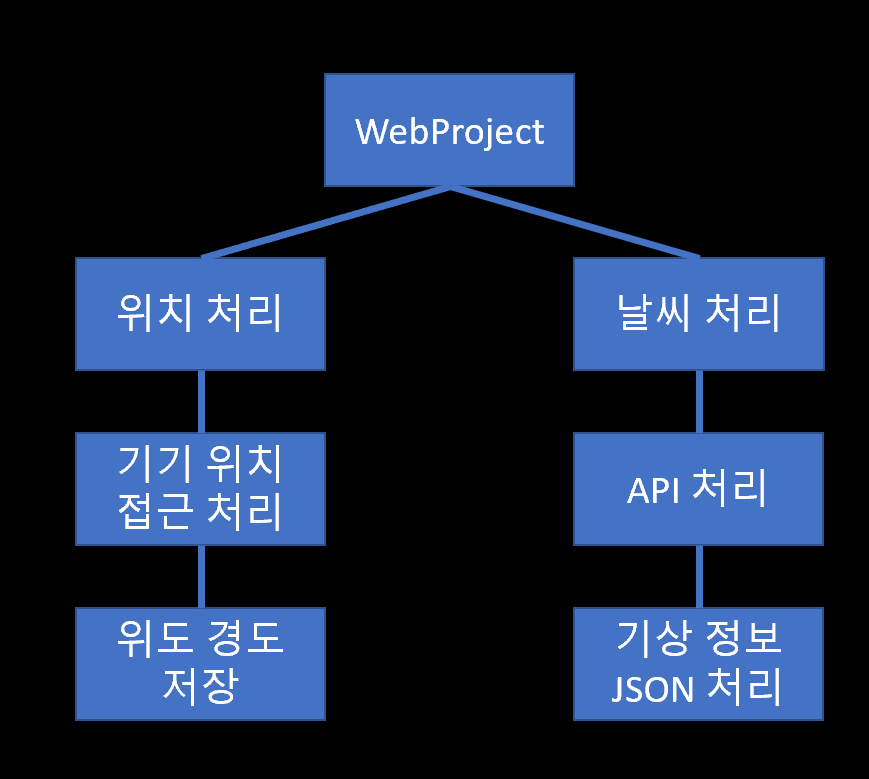
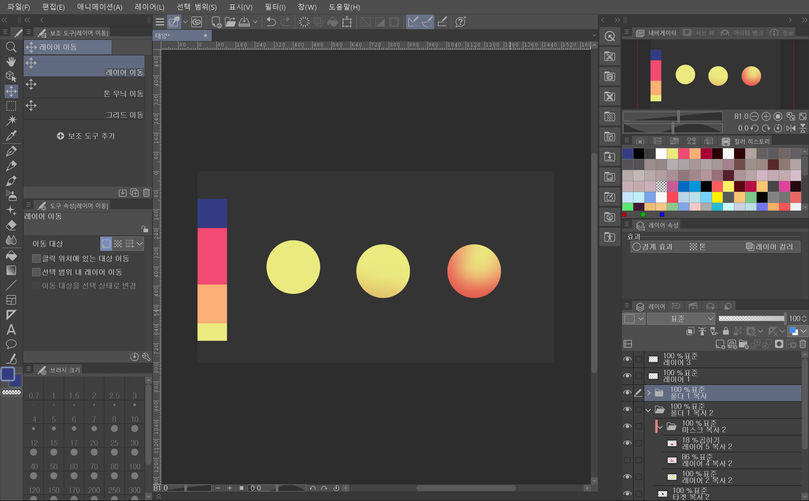
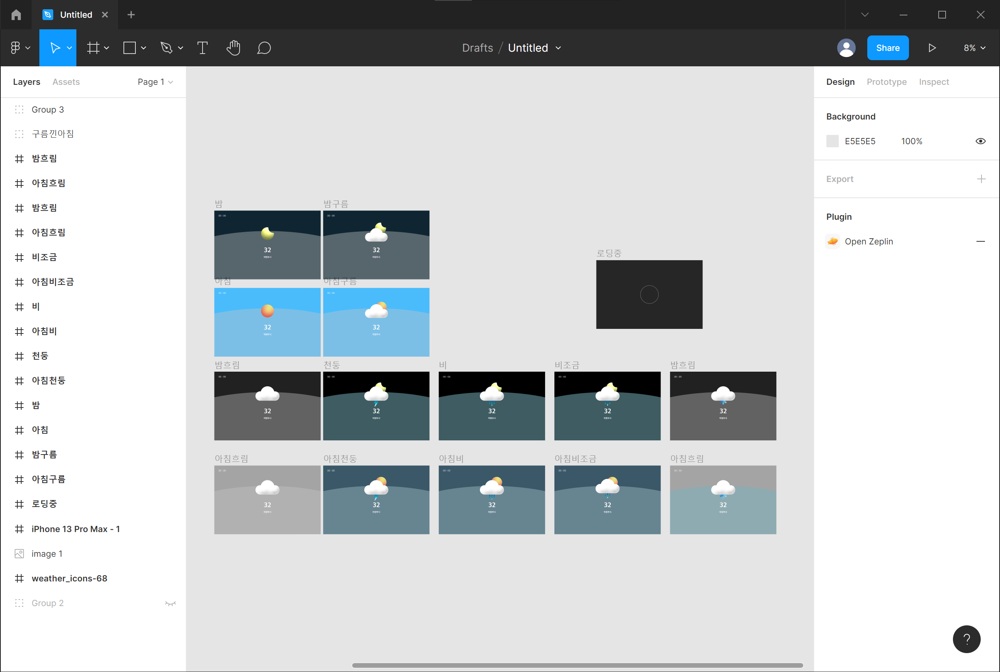
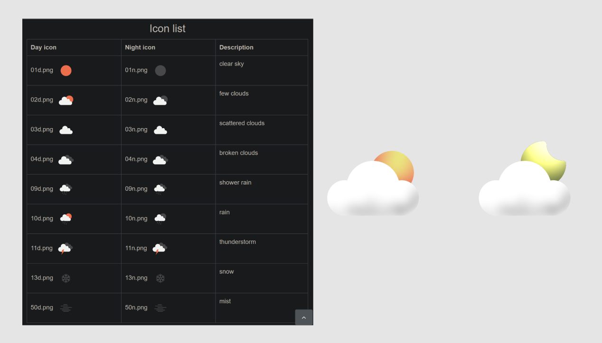
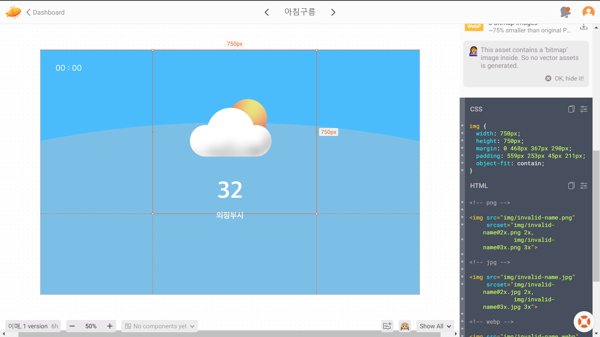
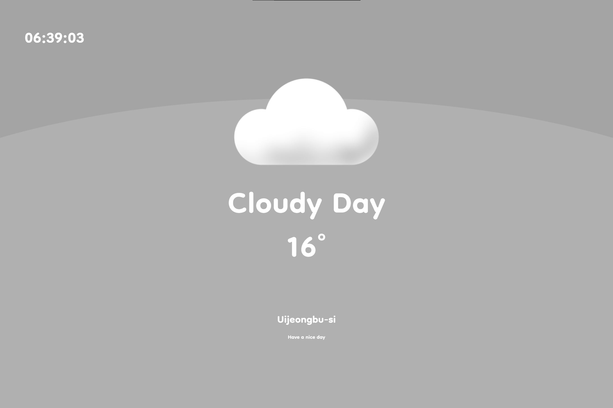
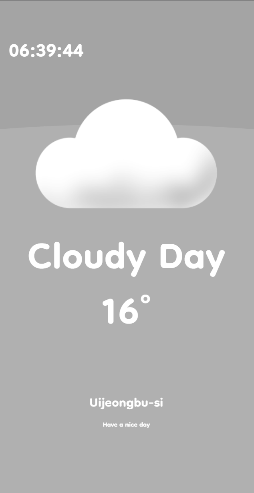

# Weather Project 시스템 설계

## 목차
[1. 개요](#dev-tech)
[2. 시스템 구조](#2-시스템-구조도)
[3. 모듈설계](#3-모듈-설계)
[4. UI 설계](#4-ui-설계)

---

## 1. 개요
* ### Dev Tech
    1. React
    2. Typescript
    3. Scss
    4. Node.js
    5. Github

## 2. 시스템 구조도

## 3. 모듈 설계
* ### 사용 모듈
  * API
    1. geoLocation
    2. openWeather
  * Import
    1. react-live-clock
    2. loading
    3. weather
    4. setBackground
    5. setEllipse
    6. web-vitals

* ### API
  * #### 1. geoLocation API
    |모듈|설명|
    |:--|:--|
    |모듈이름|naviagtor.geoLocation|
    |기능|현재 기기의 위치를 Object로 가져옵니다|
    |output|Geographic coordinate : {  - response.coors.latitude  - response.coors.longitude }|

  * #### 2. openWeather API
    |모듈|설명|
    |:--|:--|
    |모듈이름|openWeather|
    |기능|geoLocation의 위도 경도의 기상정보를 가져옵니다|
    |output|{ "weather":[...] "wind":{...} "name" : "City Name" }|

---

* ### Import
    * #### 1.react-live-clock
        |모듈|설명|
        |:--|:--|
        |모듈이름|react-live-clock|
        |기능|timezone 위치에 따른 시간 출력합니다|

    * #### 2. Loading
        |모듈|설명|
        |:--|:--|
        |모듈이름|Loading|
        |기능|geoLocation 접근 허락 유무에 따라 Loading Page와 Error Page 그리기 OpenWeather API가 Response 되었다면  기상정보에 따라 Weather Page 그리기 |
        |오류|someError : geoLocation 접근 거부|
        |멤버 변수|isLoaded: false (API Response 유무 Boolean)  error : null : (에러 String)  temperature : null : (온도 Number) name:null : (기상정보 : 구름, 비, 눈) curLocation : null (현재 위치 String) |
        |매서드|componentDidMount() : state의 업데이트 조건을 작성. _getWeather(lat, long) : openWeather API fetch후 state 초기화|

    * #### 3. Weather
        |모듈|설명|
        |:--|:--|
        |모듈이름|Weather|
        |기능|Weather호출시 Prop에들어간 값을 가지고 Weather Page의 UI를 그립니다.|
        |멤버 변수|weatherCases : (String Key로 각 기상상테에 따라서 입력되는 정보 처리  ex). title텍스트, subtitle, image Icon)|
        |함수|Weather(temperature : number, name : string, curLocation : string)|

    * #### 4. setBackground
        |모듈|설명|
        |:--|:--|
        |모듈이름|setBackground|
        |기능|기상 정보를 입력받고 그에 따라 배경의 색을 다양하게 그린다.|
        |멤버 변수|weatherCasesBG : (String Key로 기상 정보 style class에 접근한다) |
        |함수|Background(name:string)|
    * #### 5. setEllipse
        |모듈|설명|
        |:--|:--|
        |모듈이름|setEllipse|
        |기능|기상 정보를 입력받고 그에 따라 언덕(타원 배경)의 색을 다양하게 그립니다.|
        |멤버 변수|weatherCasesE : (String Key로 기상 정보 style class에 접근한다) |
        |함수|Ellipse(name:string)|

 
### 4. UI 설계
#### 1. Create Icon with Clip Studio

#### 2. Create weather_from with Figma

* openWeather의 아이콘과 1대1 대응하여 새로운 아이콘 만들었습니다.

#### 3. Convert Css From with zeplin

---

## Result
### 1. PC

### 2. Mobile

